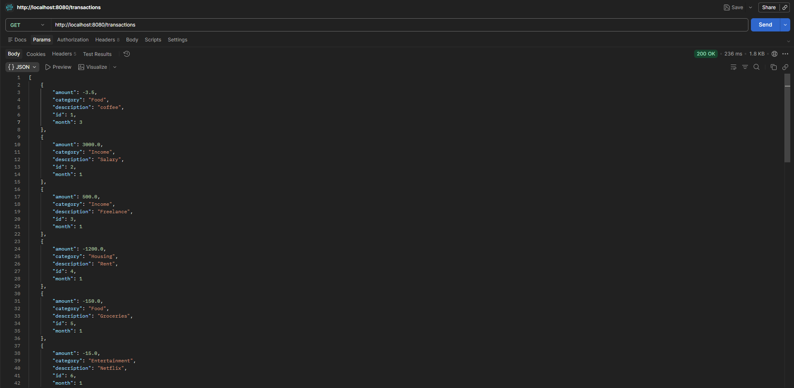

## Overview
A RESTful API for personal budget tracking built with Spring Boot and PostgreSQL

## Features
- View all transactions
- Add new transaction with description, amount, category, month
- Find specific transaction by ID
- View your stats of all transactions that total income, total expenses, current balance
- View your stats by monthly
- Persistence data storage with PostgreSQL

## Screenshot

## Class Structure
- `Transaction` (Entity): Defines the database table for this API
- `BudgetRepository` (Repository): Interface for CRUD operations using JPA
- `BudgetService` (Service): Handles all business logic
- `TransactionController` (Controller): Handles all HTTP requests and defines API endpoints

## API Endpoints
| Method | Endpoint         | Description|
|--------|------------------|------------|
| GET    | `/transactions`  |Get all transactions|
| POST   | `/add`           |Add a new transaction|
| GET    | `/find`          |Find transaction by ID|
| GET    | `/stats`         |Get overall stats|
| GET    | `/stats/monthly` |Get monthly summary|

## Prerequisites
- JAVA 21
- PostgreSQL
- Maven

## How to run 
1. git clone https://github.com/kai0609-bit/Budget-Tracker-API
2. Run PostgreSQL in your local
3. Configure database connection in src/main/resources/application.properties
4. mvn spring-boot:run
5. Access to http://localhost:8080/transactions

## Tech Stack
- Java 21 / Spring Boot 4.0.3
- PostgreSQL 16 (Self-hosted on Linux / Ubuntu 24)
- Maven

## Testing
- Postman

## What I learned
- **Spring Boot**: Setting up a web application with Spring Boot including Controllers, Services, and Repositories.
- **RESTful API**: Setting up Endpoints with using HTTP methods.
- **PostgreSQL**: Connecting remote database from Spring Boot application. 
- **Linux/Firewall**: Allow remote connection by releasing port by UFW.
- **Deployment**: Deploying a Spring Boot application to Linux server.
